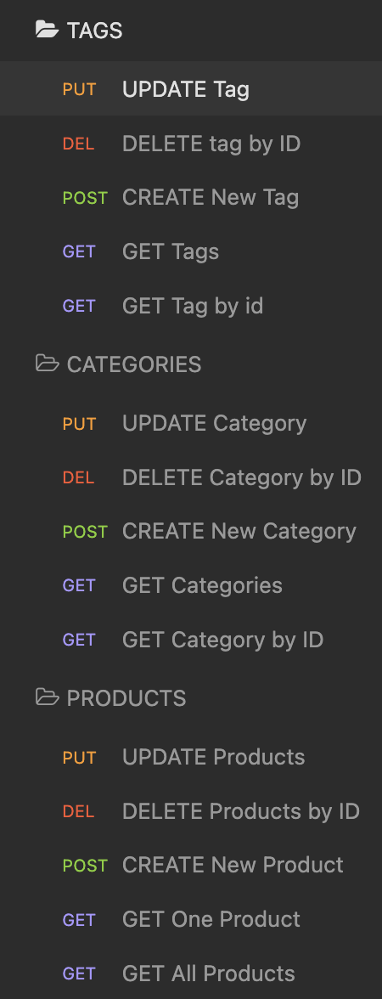
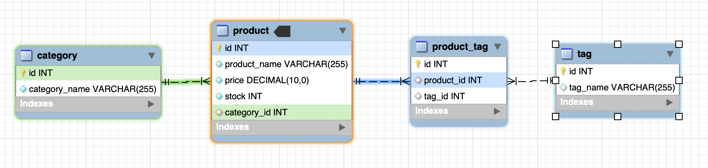
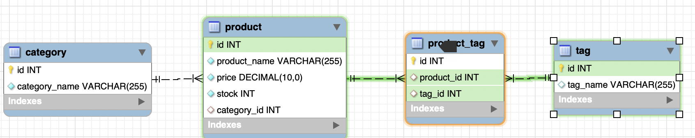
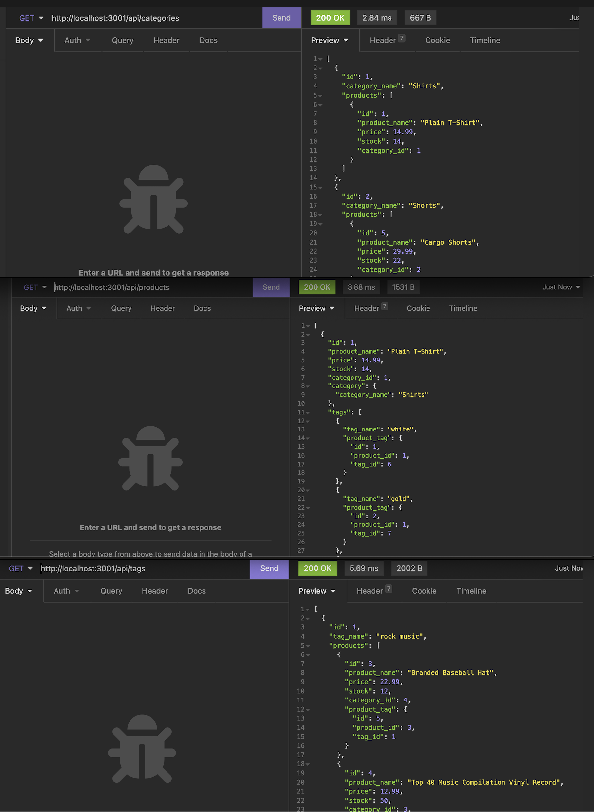
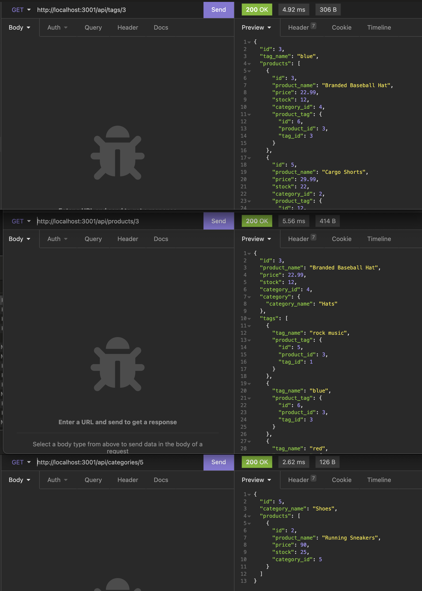
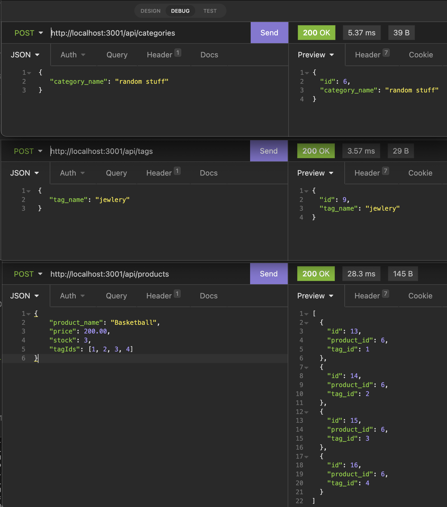
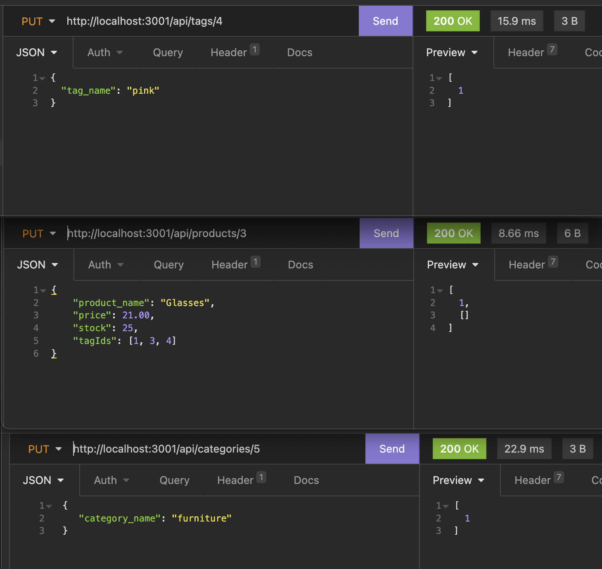
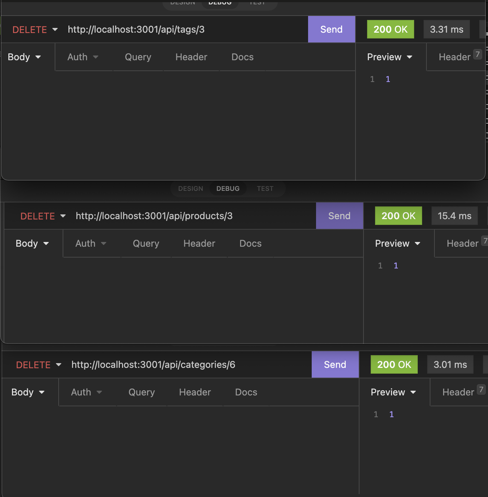

# E-Commerce

## GitHub Repository & Walkthrough Video
* https://github.com/ila0406/E-Commerce
* [Walkthrough Video - Google Drive](https://drive.google.com/drive/u/0/folders/1EzVtK5b6qJA6D8YpUOKvnYlV5kmU73My)
* [Walkthrough Video - Loom](https://www.loom.com/share/ae518169a2324f0fa6e3db3efc82b637)

## 
* [Description](#description)
* [Technolgies Used](#technolgies-used)
* [Installation Instructions](#installation-instructions)
* [Usage Info](#usage-info)
* [Contribution Guide](#contribution-guide)
* [Instructions for testing](#instructions-for-testing)
* [Questions](#questions)
* [Screenshots](#screenshots) 

## 
This repository contains the back end for an e-commerce site. It has been configured with a working Express.js API to use Sequelize to interact with a MySql database. 

## 
* Javascript 
* MYSQL2 
* Sequelize 
* Express.js

## 
1) Run > npm i to install node packages
2) Run mysql commands to create and seed databases
3) Add env file with `DB_USER='' DB_PW='' DB_NAME='ecommerce_db'`
4) Run > npm start to begin program

## 
Once Installed 
1) Navigate to db folder in terminal 
2) Login to mysql with `mysql -u root -p` 
3) Run `SOURCE schema.sql `
4) `quit` mysql server
5) Run `npm run seed` 
6) Run `npm start`

## 
* Starter code was provided by DU
* Received advice from tutor, instructors, and fellow class members

## 
* Routes can be tested with Insomonia
* DB can be tested by running queries directly against seeded DB

## 

### Insomonia Routes
* Insomonia Route Structure 

* [Shorter - Product Route Video](https://www.loom.com/share/2ebda8ec107d4fa78dd1d4ff3916720a)
* [Shorter - Category Route Video](https://www.loom.com/share/ad94785cabf94d4386dbbac2559d5e84)
* [Shorter - Tag Route Video](https://www.loom.com/share/e741c3a3ca8a4aee843cc6a8aabf13c6)

### DB Structure 

### GET all

### GET by ID

### POST

### PUT

### DELETE

## 
If you have questions, you can either open a issue in my Github repository  
GitHub: <https://github.com/ila0406>  
 
Or you can send me an email directly  
Email: <ila0406@gmail.com>
